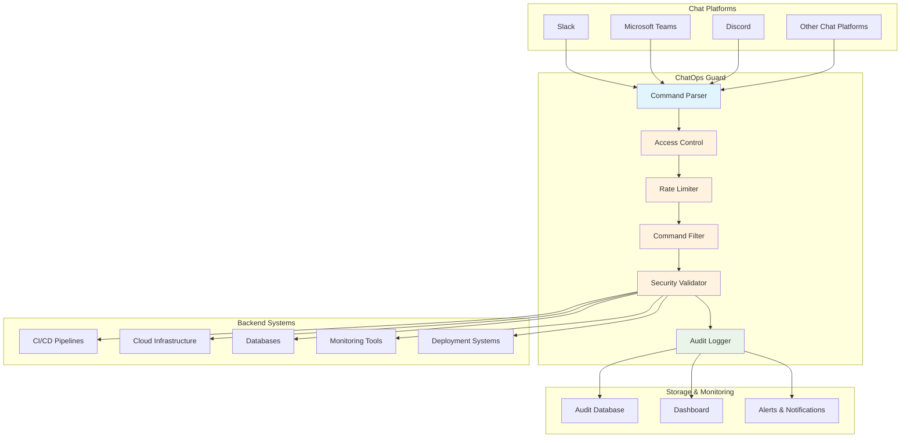

# ChatOps Guard

A security and monitoring tool for ChatOps environments that helps protect and control chat-based operations.

## Overview

ChatOps Guard is designed to provide security, monitoring, and access control for ChatOps (Chat Operations) workflows. It helps organizations safely implement chat-based automation by providing guardrails and security measures for bot interactions and automated processes.

## Architecture



**Flow Description:**
1. **Input**: Users send commands through various chat platforms
2. **Parsing**: Commands are parsed and structured by ChatOps Guard
3. **Security Pipeline**: Commands pass through multiple security layers:
   - Access control validates user permissions
   - Rate limiting prevents abuse
   - Command filtering validates syntax and content
   - Security validator performs final checks
4. **Execution**: Approved commands are forwarded to backend systems
5. **Logging**: All activities are logged for audit and monitoring
6. **Monitoring**: Dashboard and alerts provide real-time visibility

## Features

- **Access Control**: Manage who can execute specific ChatOps commands
- **Audit Logging**: Track and log all ChatOps activities for compliance and security
- **Command Filtering**: Filter and validate commands before execution
- **Rate Limiting**: Prevent abuse through configurable rate limits
- **Integration Ready**: Easy integration with popular chat platforms and CI/CD tools

## Installation

```bash
# Installation instructions will be added as the project develops
# Stay tuned for release packages and installation guides
```

## Usage

```bash
# Usage examples will be provided once the core functionality is implemented
# Check back for comprehensive documentation and examples
```

## Configuration

Configuration details and examples will be documented as features are implemented.

## Contributing

We welcome contributions to ChatOps Guard! Here's how you can help:

1. Fork the repository
2. Create a feature branch (`git checkout -b feature/amazing-feature`)
3. Commit your changes (`git commit -m 'Add some amazing feature'`)
4. Push to the branch (`git push origin feature/amazing-feature`)
5. Open a Pull Request

### Development Setup

Development setup instructions will be added as the project structure is established.

## Security

If you discover a security vulnerability, please report it responsibly by emailing the maintainer rather than opening a public issue.

## License

This project is licensed under the MIT License - see the [LICENSE](LICENSE) file for details.

## Roadmap

- [ ] Core security framework
- [ ] Chat platform integrations
- [ ] Command validation system
- [ ] Audit logging implementation
- [ ] Web dashboard for monitoring
- [ ] Plugin system for extensibility

## Author

**Hüseyin Hürkan Karaman** - [@maxmanus96](https://github.com/maxmanus96)

---

⚠️ **Note**: This project is in early development. Features and documentation will be expanded as development progresses.