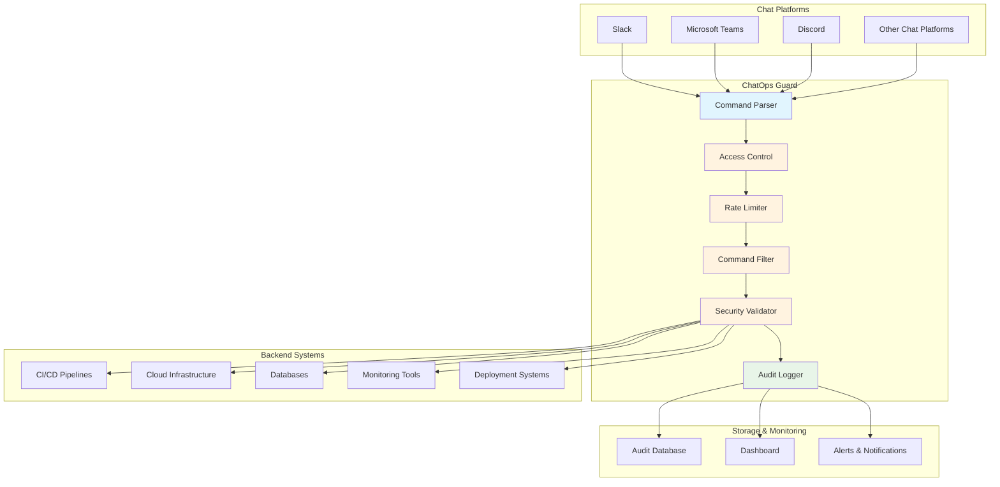

# ChatOps Guard

A security and monitoring tool for ChatOps environments that helps protect and control chat-based operations.

## Overview

ChatOps Guard is designed to provide security, monitoring, and access control for ChatOps (Chat Operations) workflows. It helps organizations safely implement chat-based automation by providing guardrails and security measures for bot interactions and automated processes.

## Architecture


```mermaid
graph TB
    subgraph "Chat Platforms"
        A[Slack] 
        B[Microsoft Teams]
        C[Discord]
        D[Other Chat Platforms]
    end
    
    subgraph "ChatOps Guard"
        E[Command Parser]
        F[Access Control]
        G[Rate Limiter]
        H[Command Filter]
        I[Audit Logger]
        J[Security Validator]
    end
    
    subgraph "Backend Systems"
        K[CI/CD Pipelines]
        L[Cloud Infrastructure]
        M[Databases]
        N[Monitoring Tools]
        O[Deployment Systems]
    end
    
    subgraph "Storage & Monitoring"
        P[Audit Database]
        Q[Dashboard]
        R[Alerts & Notifications]
    end
    
    A --> E
    B --> E
    C --> E
    D --> E
    
    E --> F
    F --> G
    G --> H
    H --> J
    J --> I
    
    I --> P
    I --> Q
    I --> R
    
    J --> K
    J --> L
    J --> M
    J --> N
    J --> O
    
    style E fill:#e1f5fe
    style F fill:#fff3e0
    style G fill:#fff3e0
    style H fill:#fff3e0
    style I fill:#e8f5e8
    style J fill:#fff3e0
```

**Flow Description:**
1. **Input**: Users send commands through various chat platforms
2. **Parsing**: Commands are parsed and structured by ChatOps Guard
3. **Security Pipeline**: Commands pass through multiple security layers:
   - Access control validates user permissions
   - Rate limiting prevents abuse
   - Command filtering validates syntax and content
   - Security validator performs final checks
4. **Execution**: Approved commands are forwarded to backend systems
5. **Logging**: All activities are logged for audit and monitoring
6. **Monitoring**: Dashboard and alerts provide real-time visibility

## Features

- **Access Control**: Manage who can execute specific ChatOps commands
- **Audit Logging**: Track and log all ChatOps activities for compliance and security
- **Command Filtering**: Filter and validate commands before execution
- **Rate Limiting**: Prevent abuse through configurable rate limits
- **Integration Ready**: Easy integration with popular chat platforms and CI/CD tools

## Installation

```bash
# Installation instructions will be added as the project develops
# Stay tuned for release packages and installation guides
```

## Usage

```bash
# Usage examples will be provided once the core functionality is implemented
# Check back for comprehensive documentation and examples
```

## Configuration

Configuration details and examples will be documented as features are implemented.

## Infrastructure & Security Notes

- Terraform lives under `infra/envs/<env>` and currently manages only the `dev` bootstrap/state resources. The live `dev` root is now state-aligned again and `terraform plan/apply` succeeds from CI.
- The active `dev` bootstrap root currently manages:
  - the state resource group
  - the state storage account and `tfstate` container
  - the Log Analytics workspace used for storage diagnostics
  - the blob-service diagnostic setting that sends storage logs/metrics to Log Analytics
- `infra/modules/aks` now exists as the first reusable platform module, and `infra/envs/dev-platform` is the first thin non-bootstrap root that composes it. That root now has its own backend/state, has safely applied `rg-chatops-guard-platform-dev` plus a minimal VNet/subnet foundation, and can produce a real `enable_aks = true` plan while AKS still stays explicitly gated by default. The AKS node subnet is associated with a minimal NSG owned by `infra/modules/network`; no broad inbound rules are added. When AKS is enabled there, `api_server_authorized_ip_ranges` must also be set so the first demo cluster does not leave its public API open unintentionally.
- `infra/modules/event-grid` provides the first event-ingestion building block: one Basic/Event Grid custom topic in `dev-platform`. This is intentionally topic-only for issue `#16`; subscriptions, queues, consumers, and summariser wiring belong to later event-pipeline work.
- `infra/modules/acr` provides the first image registry contract for issue `#31`. It is wired into `dev-platform` with `enable_acr = false` so the repo can validate the ACR shape before creating a paid always-on registry.
- `apps/summariser` is the first application skeleton: a minimal FastAPI service with `/healthz` and `/summarise` endpoints. It is intentionally rule-based for now so Docker build, Trivy image scan, CycloneDX SBOM upload, and future ACR push can be proven before adding Azure OpenAI cost or secrets.
- The first AKS rollout path was intentionally local-first to prove the cluster create with an untracked `infra/envs/dev-platform/terraform.tfvars` and a local `/32` admin IP.
- GitHub Terraform workflows now target both `dev` and `dev-platform` by default, so future AKS Terraform changes can be planned/applied from Actions as well. Drift detection also checks both roots, keeps drift issues environment-specific, and publishes count summaries instead of full Terraform plans in issues.
- Terraform workflow guardrails now reject unsupported matrix environments before Azure login. Manual destroy defaults to `dev-platform`; destroying the `dev` bootstrap/state root requires an extra bootstrap confirmation phrase.
- Terraform workflows are ready for split Azure OIDC identities: `AZURE_PLAN_CLIENT_ID` for plan/drift, `AZURE_APPLY_CLIENT_ID` for apply/destroy, and `AZURE_CLIENT_ID` only as a legacy fallback during migration.
- PR review guardrails now include a static, no-Azure-login quality workflow for GitHub Actions syntax (`actionlint`) and Terraform `fmt/init/validate`, plus Dependabot PRs for GitHub Actions and Terraform provider updates. Terraform Unit Tests also run Checkov and Trivy IaC scanning with SARIF upload. Dependabot pull requests intentionally skip Azure OIDC Terraform plans because Dependabot does not receive the normal Azure secrets; static PR Quality Review and Terraform Unit Tests are the low-cost validation path for those bumps.
- The current cost-aware demo default for AKS nodes is `Standard_D2as_v5`, not `Standard_D2_v2`. That is the current best-ROI middle ground: materially cheaper than Dv2, more modern, and less memory-constrained than the ultra-cheap `A2_v2` candidate.
- B-series was not chosen for the demo default because Microsoft documents B-series VMs as unsupported for AKS system node pools.
- The first demo AKS cluster originally kept local accounts enabled because disabling them on Kubernetes 1.25+ requires managed Entra ID integration. Issue `#52` wired that managed Entra path into Terraform so the next AKS-enabled apply can keep `local_account_disabled` on deliberately instead of by demo shortcut.
- For issue `#52`, the chosen access model is a dedicated Entra admin group, not an individual user object ID. That keeps AKS admin access transferable, reviewable, and easier to explain than binding cluster admin access to one person.
- Issue `#52` keeps `azure_rbac_enabled = false` in the first managed Entra slice. That is intentional: the smallest useful change is authentication hardening plus disabling local accounts; Azure RBAC role design is a separate authorization rollout.
- Event Grid local key authentication and public network access are disabled by default for the first topic. This keeps the first event-ingestion resource secure and Checkov-clean; the later event-pipeline work must deliberately choose either a private endpoint path or a temporary dev publishing exception.
- ACR starts with the budget-friendly Basic SKU contract, admin user disabled, anonymous pulls disabled, and public network access protected by Entra ID/RBAC. The ACR resource has inline Checkov skips for Premium/Defender-style controls such as private networking, geo/zone redundancy, dedicated endpoints, quarantine, and registry-side trust policy because this first slice keeps the registry disabled and cost-controlled.
- Production definitions exist but remain dormant until explicitly enabled via GitHub Actions `TF_TARGET_ENVS`.
- GitHub Actions workflow `.github/workflows/tf-plan-apply.yaml` uses a matrix to run `plan/apply` per environment while scoping Terraform commands to `infra/envs/<env>` so prod is untouched unless opted in.
- Security posture for the dev state storage account balances CI access with cost:
  - Public network access stays enabled so GitHub Actions can reach the backend; blob/anonymous access is disabled and shared keys are off.
  - Azure AD auth is preferred end-to-end for the storage account, and the Terraform provider is configured to use Azure AD for storage data-plane operations.
  - Diagnostics go to a Log Analytics workspace with 30-day retention, using the blob service resource scope that Azure Monitor actually supports for storage read/write/delete logs.
  - Soft delete is enabled on blob/container operations (7 days), and blob versioning remains enabled to keep tfstate recovery practical with modest dev cost impact.
  - Checkov skips in dev (documented inline in `infra/envs/dev/main.tf`) due to budget/complexity:
    - CKV2_AZURE_1 (CMK), CKV_AZURE_206 (GRS replication), CKV_AZURE_59 (public network), CKV2_AZURE_33 (private endpoint).
    - CKV_AZURE_33 (queue logging), CKV2_AZURE_21 (blob read logging).
  - Trivy skip in dev: AVD-AZU-0012 is ignored for the same documented state-backend public network tradeoff until a private runner or private endpoint path exists.
- Budget-conscious items still pending for dev (tracked in [plan.md](plan.md)):
  - Geo-redundant replication (CKV_AZURE_206) intentionally left as LRS to minimize cost.
  - Customer-managed keys (CKV2_AZURE_1), SAS expiration policy (CKV2_AZURE_41), and private endpoints (CKV2_AZURE_33) are deferred until prod hardening.
- Azure OIDC least-privilege migration details are documented in [docs/azure-oidc-least-privilege.md](docs/azure-oidc-least-privilege.md).

## Contributing

We welcome contributions to ChatOps Guard! Here's how you can help:

1. Fork the repository
2. Create a feature branch (`git checkout -b feature/amazing-feature`)
3. Commit your changes (`git commit -m 'Add some amazing feature'`)
4. Push to the branch (`git push origin feature/amazing-feature`)
5. Open a Pull Request

### Development Setup

For Terraform and workflow changes, use the local validation helper before pushing:

```bash
scripts/local_validate.sh
```

From the Flatpak/toolbox setup used for this project:

```bash
flatpak-spawn --host toolbox run -c dev bash -lc 'cd /var/home/maxmanus/Dokumente/Coding/chatops-guard && scripts/local_validate.sh'
```

The helper checks the same low-cost path we care about locally: workflow YAML parsing, `actionlint`, Terraform format/init/validate, Checkov scans for the active Terraform roots, Trivy IaC scanning, and the summariser unit tests. The expected toolbox tools are Terraform, Checkov, Trivy, PyYAML, Ruby, pytest, and actionlint.

For local container checks, use the host Podman engine:

```bash
flatpak-spawn --host podman build --format docker -t chatops-guard/summariser:local apps/summariser
```

Running GitHub Actions locally is only partial. Use `scripts/local_validate.sh` for the reliable local signal; tools such as `act` can emulate some workflow shell steps, but they do not faithfully prove GitHub OIDC, repository secrets, SARIF upload permissions, branch protections, or hosted-runner behavior.

The GitHub Wiki should stay a navigation layer, not a second source of truth. A starter Wiki page is tracked at [docs/wiki/Home.md](docs/wiki/Home.md) so changes remain reviewable before being copied or synced to the GitHub Wiki.

## Security

If you discover a security vulnerability, please report it responsibly by emailing the maintainer rather than opening a public issue.

## License

This project is licensed under the MIT License - see the [LICENSE](LICENSE) file for details.

## Roadmap

- [ ] Core security framework
- [ ] Chat platform integrations
- [ ] Command validation system
- [ ] Audit logging implementation
- [ ] Web dashboard for monitoring
- [ ] Plugin system for extensibility

## Author

**Hüseyin Hürkan Karaman** - [@maxmanus96](https://github.com/maxmanus96)

---

⚠️ **Note**: This project is in early development. Features and documentation will be expanded as development progresses.
